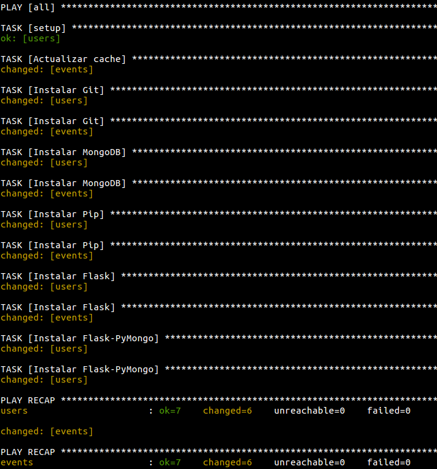

# GEventator

## Vagrant-AWS-Ansible

En primer lugar, hay que crearse un usuario en AWS, para ello, seguir los pasos de este tutorial: http://docs.aws.amazon.com/AWSEC2/latest/UserGuide/get-set-up-for-amazon-ec2.html

Una vez hecho, recoger los datos necesarios para editar el fichero `aws-credentials`.

Instalar Vagrant 1.8.7 (es importante usar esta versión ya que, de lo contrario, no funcionará el plugin para conectarse a AWS).

Instalar el plugin `vagrant-aws`:

```
vagrant plugin install vagrant-aws
```

Para exportar las variables de entorno necesarias, ejecutar:

```
source aws-credentials
```

Y finalmente para levantar ambas máquinas virtuales:

```
vagrant up --provider=aws-credentials
```

Para conectarse a cualquiera de las dos máquinas usar:

```
vagrant ssh users
```

o:

```
vagrant ssh events
```

El resultado de salida tiene que ser similar al siguiente:



---

Volver a [home](index)
